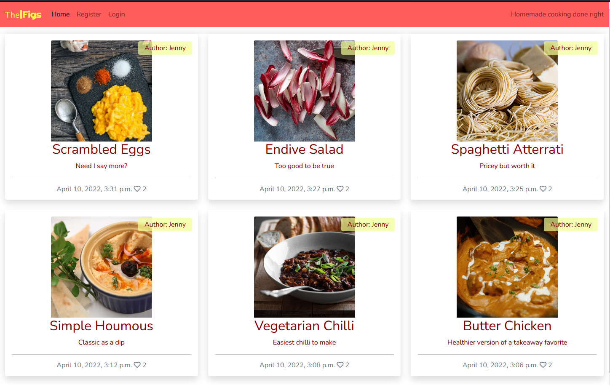

# The Figs

## Intro

The Figs is a web blog made using Django as a portfolio project for Code Institute. It is a cooking blog with recipes shared by a few authors. The recipes iclude an image, description, ingredients and steps to prepare. Everyone can access and read the blog, but only registered users can like and comment on the recipes. The comments also need to be approved by the admin.

This is the fourth project for Code Institute's Diploma in Software Development with eCommerce. It was completed by following the walkthrough in the course as well as using the documentation on the languages as well as multiple online resources in order to modify, edit and customize to my own idea.

It uses HTML, CSS, JavaScript and Python, along with Django and Bootstrap.

You can find the live page on Heroku by [clicking here](https://thefigs.herokuapp.com/).

## UX

### Strategy Plane

The Figs is a blog website intended for users to get inspired by new recipes and ideas. They can leave a comment for other users to read and also like the recipes. It is meant as a place for discovery of cooking suggestions. The colors should be calming and not too saturated so they don't clash with the food images on the page.

**The user:**

- Person curious about new recipes
- Person looking for inspiration to cook
- Person who enjoys cooking

**Website Goal:**

- Exhibit new recipe ideas
- Give people chance to interact with authors and recipes
- Create unique recipes

**User stories:**

*These were suggested in the walkthrough.*

1. Site pagination
2. View post list
3. Open a post
4. View likes
5. View comments
6. Account registration
7. Comment on a post
8. Like / unlike
9. Manage posts
10. Create Drafts
11. Approve comments

### Scope Plane

**Features**

- Responsive Design - easy to access and view on multiple devices
- User Interaction - users need to register in order to comment and like posts
- Recipes - any user can access and read recipes
- Registration - links for the users to register, login and logout
- Comments - comments need to be approved before being displayed

### Structure Plane

**Pages**

- The site contains a main page showing the recently added recipes, more pages are created after the limit of 6 recipe cards are displayed
- There a page for each recipe that gets added, where comments can be made
- There are registration, login and logout pages

**Code**

- The site uses one app called blog
- It was built using Django
- It uses templates

**Database**

- The site uses PostgreSQL on Heroku

#### Database Plan:

#### post was later changed to recipe:

