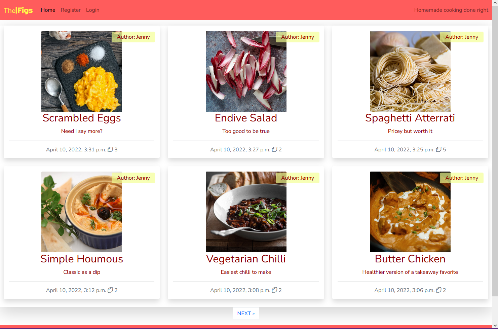
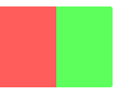
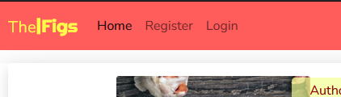
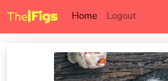
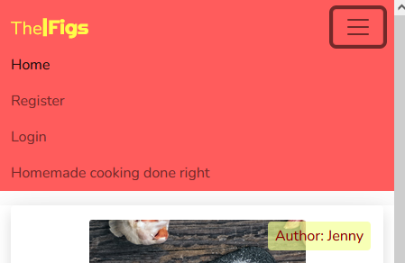
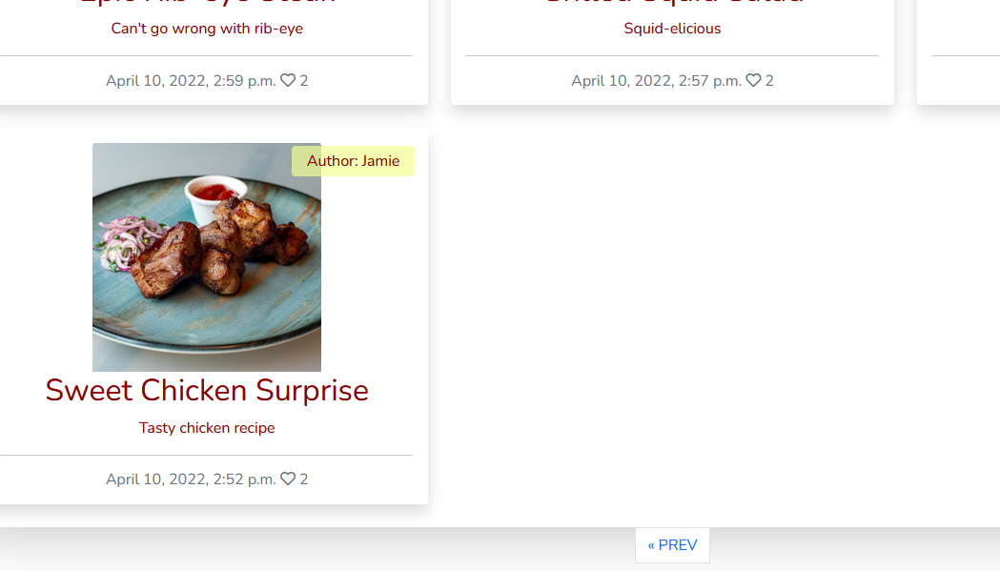
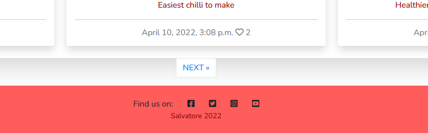
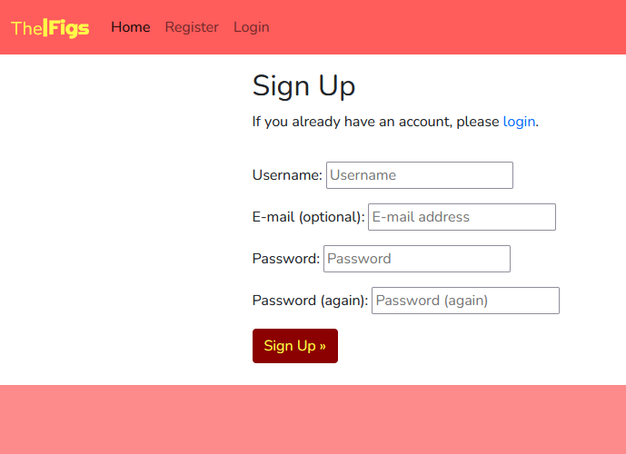
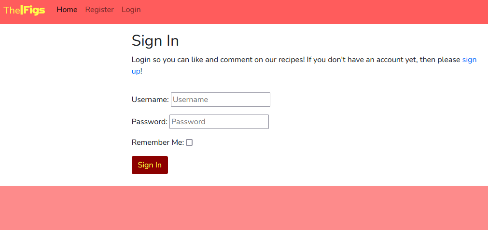
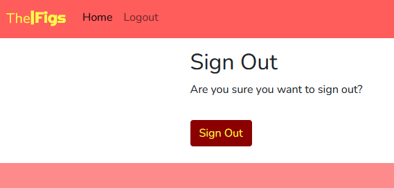

# The Figs

## Intro

The Figs is a web blog made using Django as a portfolio project for Code Institute. It is a cooking blog with recipes shared by a few authors. The recipes iclude an image, description, ingredients and steps to prepare. Everyone can access and read the blog, but only registered users can like and comment on the recipes. The comments also need to be approved by the admin.

This is the fourth project for Code Institute's Diploma in Software Development with eCommerce. It was completed by following the walkthrough in the course as well as using the documentation on the languages as well as multiple online resources in order to modify, edit and customize to my own idea.

It uses HTML, CSS, JavaScript and Python, along with Django and Bootstrap.

You can find the live page on Heroku by [clicking here](https://thefigs.herokuapp.com/).

## UX

### Strategy Plane

The Figs is a blog website intended for users to get inspired by new recipes and ideas. They can leave a comment for other users to read and also like the recipes. It is meant as a place for discovery of cooking suggestions. The colors should be calming and not too saturated so they don't clash with the food images on the page.

**The user:**

- Person curious about new recipes
- Person looking for inspiration to cook
- Person who enjoys cooking

**Website Goal:**

- Exhibit new recipe ideas
- Give people chance to interact with authors and recipes
- Create unique recipes

**User stories:**

*These were suggested in the walkthrough.*

1. Site pagination
2. View post list
3. Open a post
4. View likes
5. View comments
6. Account registration
7. Comment on a post
8. Like / unlike
9. Manage posts
10. Create Drafts
11. Approve comments

### Scope Plane

**Features**

- Responsive Design - easy to access and view on multiple devices
- User Interaction - users need to register in order to comment and like posts
- Recipes - any user can access and read recipes
- Registration - links for the users to register, login and logout
- Comments - comments need to be approved before being displayed

### Structure Plane

**Pages**

- The site contains a main page showing the recently added recipes, more pages are created after the limit of 6 recipe cards are displayed
- There a page for each recipe that gets added, where comments can be made
- There are registration, login and logout pages

**Code**

- The site uses one app called blog
- It was built using Django
- It uses templates

**Database**

- The site uses PostgreSQL on Heroku

#### Database Plan:

#### *post was later changed to recipe:*

### Skeleton Plane

**Wireframes**

Home page - where the user should find the recipes along with a navbar and footer.

Recipe - where the user can read the recipe and leave a comment and like if registered

Not logged in, the comment box isn't visible:

Logged in, the comment box should be visible:

Phone recipe page:

Register and login pages are similar in format

Logout confirmation page

### Surface Plane

**Design**

The layout of the website is functional and simple to navigate. It minimizes the amount of time the user has to worry about looking for links, the navbar should clearly displayed and accessible. The recipes should be clearly presented, organized and easy to click to read more. 

The colour choice was based on the knowledge that warmer tones like yellow and red are appropriate for food themes. A more pastel shade of those colours should also bring calmness and less irritation than more vibrant colours.

**Images**

The images should represent the recipe, its ingredients or the act of cooking itself. They are sourced from free stock image websites. 

## Features

### Navigation 

The navigation bar sits permanently at the top giving the user the option to go to the home page, register, login or logout.

First time or unregistered users:

When logged in:

Mobile users have a different view of the navbar, it has a typical burger menu button:

Mobile when opened:

The homepage holds the recipe index where users can click on the title or image to open the page with more details about the selected recipe:

The site is automatically paginated as more recipes are added to it. There are six recipes displayed per index page. Newer ones will be shown at the beginning and older ones get moved to the following pages.

Pagination:

Older recipes on later pages:

The footer holds links to social media sites:

The registration page is where users can create an account to be able to post comments and like recipes, the will need a username, email(optional), and password. It will also ask them to login if they already have an account, and provide a link to it:

The login page will ask for the returning user's credentials. It will also give a new user a message and a link to signup in case they are in the wrong page:

The logout page will ask for the user's confirmation of logging out with a button:

