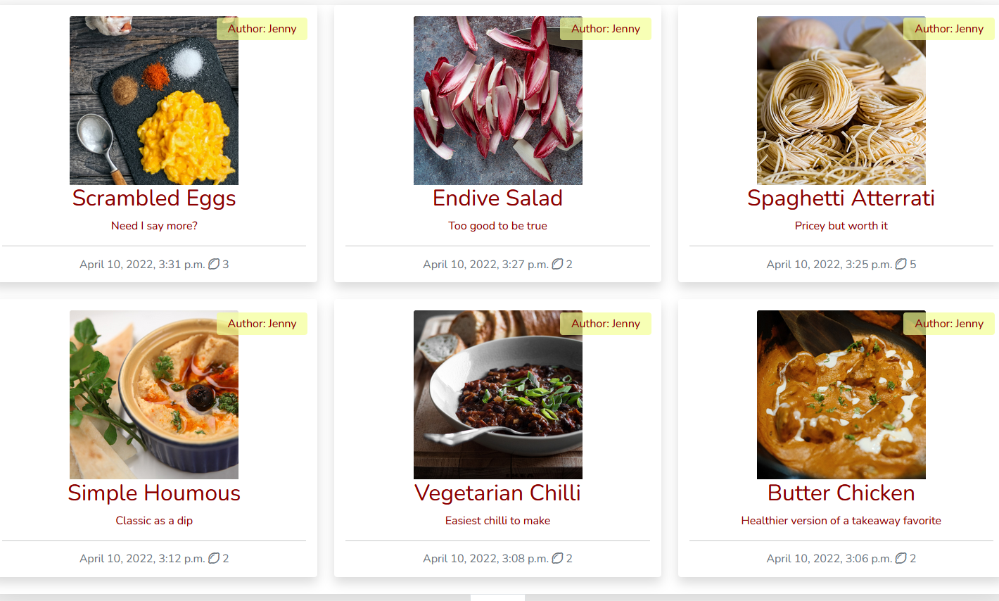
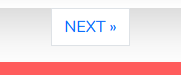
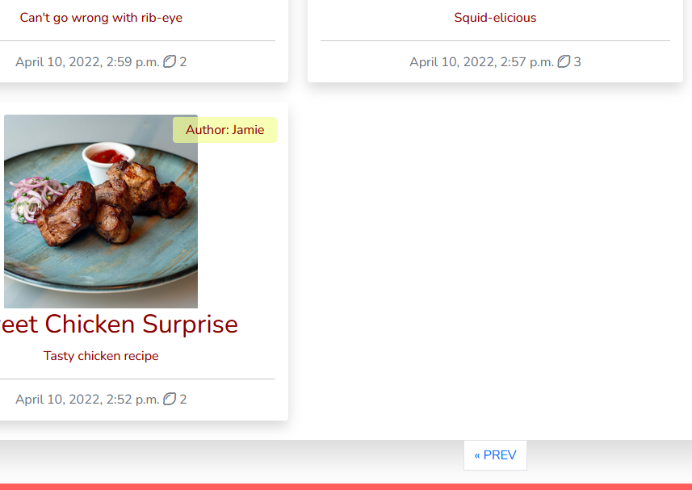
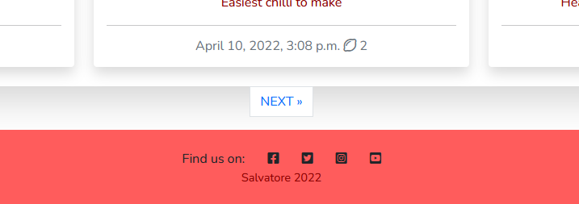
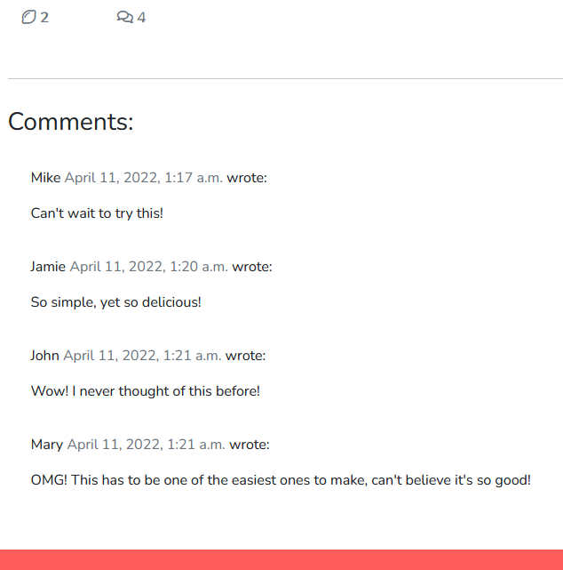

# The Figs

## Intro

The Figs is a web blog made using Django as a portfolio project for Code Institute. It is a cooking blog with recipes shared by a few authors. The recipes iclude an image, description, ingredients and steps to prepare. Everyone can access and read the blog, but only registered users can like and comment on the recipes. The comments also need to be approved by the admin.

This is the fourth project for Code Institute's Diploma in Software Development with eCommerce. It was completed by following the walkthrough in the course as well as using the documentation on the languages as well as multiple online resources in order to modify, edit and customize to my own idea.

It uses HTML, CSS, JavaScript and Python, along with Django and Bootstrap.


You can find the live page on Heroku by [clicking here](https://thefigs.herokuapp.com/).

## Table of Contents

* [User Experience](#ux)
    * [Strategy Plane](#strategy-plane)
    * [Scope Plane](#scope-plane)
    * [Structure Plane](#structure-plane)
    * [Skeleton Plane](#skeleton-plane)
    * [Surface Plane](#surface-plane)
* [Features](#features)
    * [Future Features](#future-features)
* [Technologies Used](#technologies)
* [Testing](#tests)
* [Deployment](#deployment)
* [Credits](#credits)

## UX

### Strategy Plane

The Figs is a blog website intended for users to get inspired by new recipes and ideas. They can leave a comment for other users to read and also like the recipes. It is meant as a place for discovery of cooking suggestions. The colors should be calming and not too saturated so they don't clash with the food images on the page.

**The user:**

- Person curious about new recipes
- Person looking for inspiration to cook
- Person who enjoys cooking

**Website Goal:**

- Exhibit new recipe ideas
- Give people chance to interact with authors and recipes
- Create unique recipes

**User stories:**

*These were suggested in the walkthrough.*

1. Site pagination
2. View post list
3. Open a post
4. View likes
5. View comments
6. Account registration
7. Comment on a post
8. Like / unlike
9. Manage posts
10. Create Drafts
11. Approve comments

### Scope Plane

**Features**

- Responsive Design - easy to access and view on multiple devices
- User Interaction - users need to register in order to comment and like posts
- Recipes - any user can access and read recipes
- Registration - links for the users to register, login and logout
- Comments - comments need to be approved before being displayed

### Structure Plane

**Pages**

- The site contains a main page showing the recently added recipes, more pages are created after the limit of 6 recipe cards are displayed
- There a page for each recipe that gets added, where comments can be made
- There are registration, login and logout pages

**Code**

- The site uses one app called blog
- It was built using Django
- It uses templates

**Database**

- The site uses PostgreSQL on Heroku

#### Database Plan:


#### *post was later changed to recipe:*


### Skeleton Plane

**Wireframes**

Home page - where the user should find the recipes along with a navbar and footer.


Recipe - where the user can read the recipe and leave a comment and like if registered

Not logged in, the comment box isn't visible:


Logged in, the comment box should be visible:


Phone recipe page:


Register and login pages are similar in format


Logout confirmation page


### Surface Plane

**Design**

The layout of the website is functional and simple to navigate. It minimizes the amount of time the user has to worry about looking for links, the navbar should clearly displayed and accessible. The recipes should be clearly presented, organized and easy to click to read more. 

The colour choice was based on the knowledge that warmer tones like yellow and red are appropriate for food themes. A more pastel shade of those colours should also bring calmness and less irritation than more vibrant colours.


**Images**

The images should represent the recipe, its ingredients or the act of cooking itself. They are sourced from free stock image websites. 

## Features

### Navigation 

The navigation bar sits permanently at the top giving the user the option to go to the home page, register, login or logout.

First time or unregistered users:


When logged in:


Mobile users have a different view of the navbar, it has a typical burger menu button:


Mobile when opened:


The homepage holds the recipe index where users can click on the title or image to open the page with more details about the selected recipe. The cards in the index contain a photo, title, author's name, an excerpt, date it was created and number of likes:



The site is automatically paginated as more recipes are added to it. There are six recipes displayed per index page. Newer ones will be shown at the beginning and older ones get moved to the following pages.

Pagination:



Older recipes on later pages:



The footer holds links to social media sites:



The registration page is where users can create an account to be able to post comments and like recipes, the will need a username, email(optional), and password. It will also ask them to login if they already have an account, and provide a link to it:


The login page will ask for the returning user's credentials. It will also give a new user a message and a link to signup in case they are in the wrong page:


The logout page will ask for the user's confirmation of logging out with a button:


When a user registers/logs in or logs out, a message will be displayed at the top of the recipe index and beneath the navbar indicating their status:


The recipe's detail page contains a title with an image, the author's name and date it was created on. It also has a brief intro followed by the ingredients and steps to prepare:


Beneath the recipe's steps, there is a like and comment counter. When the logged in user has already liked a recipe he will see it in solid red colour:


The comment section is displayed at the bottom left of the recipe detail page. Comments are only shown after admin approval, but once approved anyone can see them. It includes the user's username, time of writing and the comment itself:



To leave a comment a user will need to be registered and logged in otherwise they will not have the option to do so as they won't see this comment box. Above the box the user can see his username and a submit button at the bottom:


Once submitted, the comment still needs approval by the admin. The user will be notified that their comment is still pending the approval with a message where the comment box used to be:


### Future Features

- Create user profile pages
- Allow users to share recipes
- Allow users to save their favorite recipes to their profile
- Switch from blog to a more social community website

## Tests

**Validators**

Validators were used to check the HTML, CSS and JavaScript part of the code.

HTML:


CSS:


The CSS was valid but 236 warnings were raised due to Bootstrap and Font Awesome.

Errors were checked for in python during writing as they would be pointed out in Gitpod's console. Also the errors shown on the local server while DEBUG was set to True in the project's *settings.py* file.

A number of manual tests were completed to be sure that the app was functioning according to plan as well as to see if the responsiveness was working.

All tests were performed on Desktop and Mobile devices.

**Navbar / Footer**

- Navbar appearance and functionality
- Navbar links
- Navbar link status depending on login/logout
- Footer links

**Index**

- Content is visible and understandable
- Placement of cards in the index
- Pagination - automatic generation and next/previous buttons
- Clicking a recipe card would link to the correct page

**Recipe**

- Recipe detail page layout
- Order and placement of content
- Like and comment counters
- Comments display
- Comment box visibility only logged in
- Message of awaiting approval after comment submission

**Registration**

- Register page layout
- Username, email and password fields work
- Register button works
- Message and link to login work
- Redirects to home page with temporary message below navbar

**Login**

- Login page layout
- Username and password fields displayed and working
- Login button working
- Message and link to register work
- Redirects to home page with temporary message below navbar

**Logout**

- Logout page display
- Logout message visible
- Logout button works
- Redirects to home page with temporary message below navbar

**Browser**

- Chrome
- Firefox
- Safari

I also ran the main page through Chrome's lighthouse to have an evaluation.

This is for the desktop version of the site:


And mobile version of the site:


### Bugs

Most bugs were typing errors that were immediately corrected. The most difficult part to me was navigating Bootstrap and my own CSS file. 

I used a lot of the Bootstrap documentation to try and achieve what I wanted but still had to rely on CSS for more custom things.

The most notable bug i encountered was the fact that the burger menu button for mobile devices became invisible. It took me the longest to solve and I relied on a lot of trial and error along with using Bootstrap documentation and Stack Overflow.

Here is the bug:


It was solved by adding a specific Bootstrap class called ```nav-light```.

## Technologies

- Python - Libraries
- Django - Main framework
- HTML - Base templates
- CSS - Custom styling
- JavaScript - Code to make temporary message
- Font Awesome - Lemon like button and comment counter
- Bootstrap - Layout
- Heroku - Deployment
- Heroku PostgreSQL - Database

Multiple python libraries were used and they are listed in the [requirements.txt](https://github.com/saltta/figs/blob/main/requirements.txt).

**Packages**

- Gitpod - Writing, editing and pushing code
- GitHub - Holds the project
- Balsamiq - Wireframes
- Cloudinary - Image hosting

**Resources**

- Code Institute walkthrough
- [Django documentation](https://www.djangoproject.com/)
- [W3Schools](https://www.w3schools.com/)
- [Bootstrap documentation](https://getbootstrap.com/)
- [Stack Overflow](https://stackoverflow.com/)
- Articles

## Deployment

Heroku is used to deploy the website. [The Figs](https://thefigs.herokuapp.com/)

### Developing

1. Create a new repository on GitHub using Code Institute's [Gitpod Full Template](https://github.com/Code-Institute-Org/gitpod-full-template).
1. Open the repository you just created and from there you can:
    * Create a workspace by prefixing any GitHub URL with gitpod.io/#, or
    * By using Gitpod browser extension, it adds a button to GitHub.
1. Through Gitpod you will push your commits straight to GitHub.

### Cloudinary Hosting

1. Create an account on [Cloudinary](https://cloudinary.com/)
2. Click on signup for free
3. Fill out the form and click create an account
4. Confirm via the link in your email
5. Access your dashboard on Cloudinary

### Deploying to Heroku

1. Create an account on [Heroku](https://www.heroku.com/)
2. Create an app, in my case *thefigs* and select a region
3. Under resources search for postgres and add a Postgres database to the app, I used Heroku Postgres
4. Set DATABASE_URL as an environment variable in Heroku's settings by clicking on config vars, and your local environment variables#
5. Log into Cloudinary, go to dashboard and copy your CLOUDINARY_URL
6. Make sure to add to your environment variables as well
5. Create a file called Procfile and write ```web: gunicorn <PROJECT_NAME>wsgi```
6. Add enviroment variables to Heroku's Config Vars
7. In your project's settings.py ensure the connection is to the Heroku Postgres database
8. Make sure DEBUG is set to false in the settings.py file, this is very important to remember before final deployment
9. Add 'localhost', and '<PROJECT_NAME>.herokuapp.com' to the ALLOWED_HOSTS variable in settings.py
11. Run ```python3 manage.py migrate``` in the terminal to migrate the database
12. Run ```python3 manage.py createsuperuser``` to create a super admin user
13. In the deploy tab in Heroku, connect the app to GitHub
14. Scroll down and click deploy branch to deploy your application to Heroku

### Forking GitHub Repository

1. Log in to GitHub and locate [my GitHub Repository](https://github.com/saltta/figs)
2. At the top of the Repository, click the "Fork" button.
3. You should now have a copy of the original repository in your GitHub account.

## Credits

### Walkthrough

The walkthrough I followed is part of the course for Software Developer at [Code Institute](https://codeinstitute.net/).

### Media and Design

Sources of images, fonts, colour schemes

- [Pexels](https://www.pexels.com/)
- [Unsplash](https://unsplash.com/)
- [Google Fonts](https://fonts.google.com/)
- [ColorHexa](https://www.colorhexa.com/)
- [Font Awesome](https://fontawesome.com/)

### Recipes

For the recipes I used other cooking websites

- [Jamie Oliver](https://www.jamieoliver.com/)
- [BBC goodfood](https://www.bbcgoodfood.com/)

### Code

When searching for solutions I went through documentations, articles and forums

- [Django Central](https://djangocentral.com/)
- [GeeksforGeeks](https://www.geeksforgeeks.org/)


